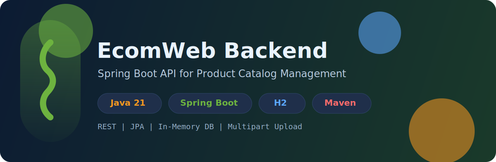

# EcomWeb Backend (Spring Boot)



A Spring Boot backend for an e-commerce product catalog with CRUD operations, keyword search, and image upload support.

## Tech Stack


## Features

- Product CRUD APIs
- Search products by keyword (`name`, `description`, `brand`, `category`)
- In-memory H2 database for quick development/testing
- Preloaded sample data from `data.sql`
- Multipart image upload support while creating/updating products
- H2 Console enabled

## Project Structure

```text
src/main/java/com/agrawal/ecomweb
|- controllers/ProductController.java
|- models/Product.java
|- repo/ProductRepo.java
|- service/ProductService.java

src/main/resources
|- application.properties
|- data.sql
```

## Prerequisites

- Java 21+
- Maven 3.9+ (optional if using Maven Wrapper)

## Run the Project

### Using Maven Wrapper (recommended)

```bash
./mvnw spring-boot:run
```

On Windows PowerShell:

```powershell
.\mvnw.cmd spring-boot:run
```

### Build and Run Jar

```bash
./mvnw clean package
java -jar target/ecomweb-0.0.1-SNAPSHOT.jar
```

## Default Runtime Configuration

From `src/main/resources/application.properties`:

- App name: `ecomweb`
- H2 console: enabled at `/h2-console`
- Data source: `jdbc:h2:mem:testdb`
- DDL mode: `create`
- SQL init mode: `always`

> Note: Since H2 is in-memory, data resets when the app restarts (then reseeded from `data.sql`).

## API Endpoints

Base path: `/api`

| Method | Endpoint | Description |
|---|---|---|
| GET | `/api/` | Welcome endpoint |
| GET | `/api/products` | Get all products |
| GET | `/api/products/{pid}` | Get product by id |
| POST | `/api/products` | Create product (multipart: `productData`, `imagFile`) |
| PUT | `/api/products/{pid}` | Update product |
| DELETE | `/api/products/{pid}` | Delete product by id |
| GET | `/api/products/search?keyword=...` | Search products by keyword |

## Example Request (Create Product)

```bash
curl -X POST "http://localhost:8080/api/products" \
  -H "Content-Type: multipart/form-data" \
  -F 'productData={
    "name":"iPhone 15",
    "description":"Latest Apple smartphone",
    "brand":"Apple",
    "price":79999,
    "category":"Mobiles",
    "releaseDate":"10-09-2025",
    "productAvailable":true,
    "stockQuantity":25
  };type=application/json' \
  -F "imagFile=@/path/to/image.jpg"
```

## Sample Seed Data

The project auto-loads sample records (car products) from `src/main/resources/data.sql` during startup.

## Testing

```bash
./mvnw test
```


